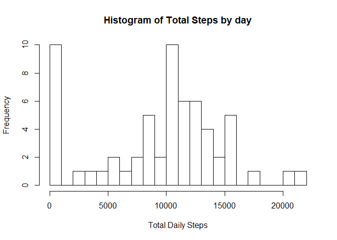
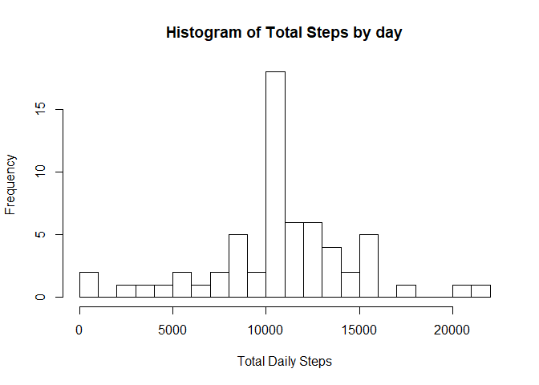

## Loading and preprocessing the data

```r
unzip(zipfile = "activity.zip")
data <- read.csv("activity.csv", header = TRUE)
head(data)
```

```
##   steps       date interval
## 1    NA 2012-10-01        0
## 2    NA 2012-10-01        5
## 3    NA 2012-10-01       10
## 4    NA 2012-10-01       15
## 5    NA 2012-10-01       20
## 6    NA 2012-10-01       25
```


## What is mean total number of steps taken per day?

```r
library(ggplot2)

total_steps <- tapply(data$steps, data$date, FUN=sum, na.rm=TRUE)

hist(total_steps, xlab = "Total Daily Steps",main="Histogram of Total Steps by day", breaks = 20)
```

<!-- -->

The mean and median of the total number of steps taken per day

```r
mean(total_steps, na.rm=TRUE)
```

```
## [1] 9354.23
```

```r
median(total_steps, na.rm=TRUE)
```

```
## [1] 10395
```


## What is the average daily activity pattern?

```r
library(ggplot2)

averages <- aggregate(x=list(steps=data$steps), by=list(interval=data$interval),FUN=mean, na.rm=TRUE)

ggplot(data=averages, aes(x=interval, y=steps)) +
    geom_line() +
    xlab("5-minute interval") +
    ylab("average number of steps taken")
```

<!-- -->

The 5-minute interval that, on average, contains the maximum number of steps

```r
averages[which(averages$steps== max(averages$steps)),]
```

```
##     interval    steps
## 104      835 206.1698
```


## Imputing missing values

The total number of missing values in the dataset (i.e. the total number of rows with NAs)


```r
sum(is.na(data$steps))
```

```
## [1] 2304
```

The missing values are filled with mean value for that 5-minute interval


```r
data_filled <- data

for (i in 1:nrow(data)){
        if(is.na(data$steps[i])){
                data_filled$steps[i]<- averages$steps[data_filled$interval[i] == averages$interval]
        }
}
```

A histogram of the total number of steps taken each day

```r
total_steps <- tapply(data_filled$steps, data_filled$date, FUN=sum)

hist(total_steps, xlab = "Total Daily Steps",main="Histogram of Total Steps by day", breaks = 20)
```

<!-- -->

The mean and median total number of steps taken per day

```r
mean(total_steps, na.rm=TRUE)
```

```
## [1] 10766.19
```

```r
median(total_steps, na.rm=TRUE)
```

```
## [1] 10766.19
```


The Mean and median values increaded after filling the missing data. It is important to note that NA values in the first part of the project were ignored (na.rm = TRUE). The impact of imputing missing data on the estimates of the mean increased from 9354.23 to 10766.19.


## Are there differences in activity patterns between weekdays and weekends?
A new factor variable in the dataset with two levels - “weekday” and “weekend” indicating whether a given date is a weekday or weekend day


```r
data_filled$date <- as.Date(data_filled$date)
data_filled$day <- ifelse(weekdays(data_filled$date) %in% c("Saturday", "Sunday"), "weekend", "weekday")
data_filled$day <- as.factor(data_filled$day)
```

A panel plot containing plots of average number of steps taken on weekdays and weekends.

```r
averages <- aggregate(steps ~ interval + day, data=data_filled, mean)

ggplot(averages, aes(interval, steps)) + geom_line() + facet_grid(day ~ .) +
    xlab("5-minute interval") + ylab("Number of steps")
```

<!-- -->
